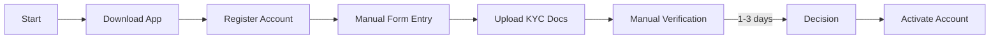
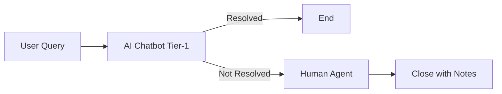

# 05 — Process Flows (Mermaid)

## As-Is: Onboarding (high level)

## To-Be: Onboarding with OCR eKYC
```mermaid
flowchart LR
A[Start] --> B[Register Account]
B --> C[Scan ID (OCR)]
C --> D[Auto-fill + Validate]
D --> E[KYC API Check]
E -->|< 30s| F[Decision]
F --> G[Activate Account]
```
## To-Be: Support Deflection
